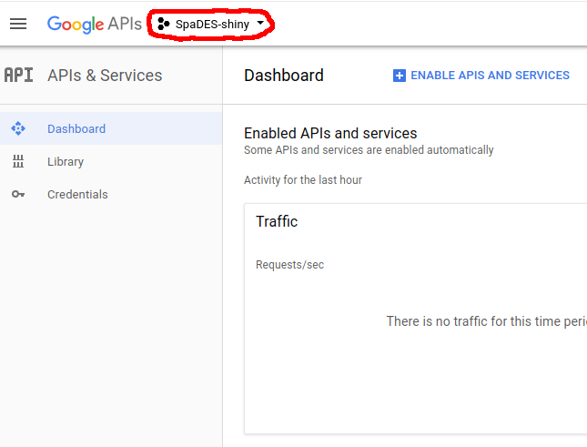
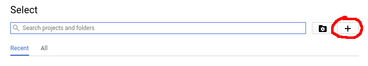
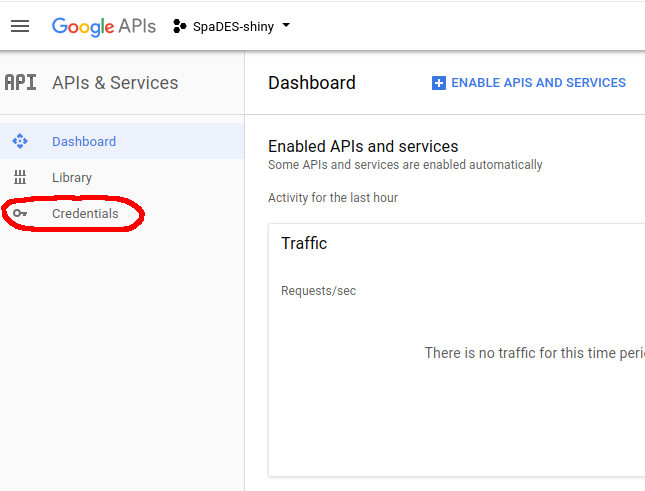
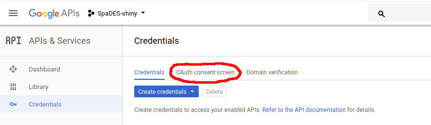

```{r setup, include = FALSE}
knitr::opts_chunk$set(
  collapse = TRUE,
  comment = "#>"
)
```

## Introduction

By default, `shiny` does not have a mechanism for logging in users, so this level of app personalization isn't possible using standard `shiny`.
However, using the `googleAuth` module we allow app content to be made conditionally available to 3 classes of user:

1. anonymous (non-logged in) users;
2. logged in users who are not autheticated against a whitelist;
3. logged in and authenticated (whitelisted) users.

This module presents the user a "Login" button which redirects to a Google authenication page.
After authenticating, an oauth token (user- and session-specific) is used by the app to determine the user's Google email address, display name, and whether they are on the app's access-control whitelist.

This has the advantage of using Google for access control management rather than locally on the shiny server.

In order to use this module for authetication, your app must:

1. be configured as a server app via Google apps;
2. refer to a file managed by Google Drive for user acces control;
3. be correctly configured to connect to the Google APIs.

This vignette explains how to do these.

## Create and configure a new Google app

1. Make sure that you are logged into Google and visit the [Google APIs project page](https://console.developers.google.com/apis/dashboard).

2. Go to the project dropdown menu, and create a new project:

  
  

  Complete the setup, and after a few seconds, you will be redirected to the Google API manager.

3. Next, we need to enable the 'Google+' and 'Google Drive' APIs for this project.
  Click on "Enable APIs and Services", search for 'Google+' and 'Google Drive', and enable.
  
  

4. Next, click on the "Credentials" tab on the left:

  

5. Navigate to "OAuth consent screen" and fill in the “Product name shown to users” form with the name of your `shiny` application.

  
  
  The information you provide in this tab populate the authentication screen that pops up when users click the "Login with Google" link in your app ([example](https://developers.google.com/accounts/images/OAuth2Consent.png)).

6. Navigate to the "Credentials" tab at the top.

  

  From the "Create Credentials" dropdown menu, select "OAuth client ID" and select "Web application"" for the application type.
  Fill in any descriptive name for this client, and in the URLs field add the URL to your app (*e.g.*, `http://youApp.example.com`).
  To facilitate testing, also add URLs for `http://127.0.0.1:5621` (for use with `shiny::runApp(..., port = 5621)`, and `http://127.0.0.1:3838` (for use with shiny-server running on port 3838).

## Create a file to use with authetication (whitelist)

The authentication mechanism used by the `googleAuth` module relies on the file permissions set on a file in Google Drive.
Simply create a blank text file (*e.g.*, name_of_your_app.txt) in Google Drive and edit the access control settings to allow only authorized users to download/view this file.
You will need the private URL (link) to this file.
Assign this URL to a variable in your `global.R` and pass that as the `authFile` argument when calling the `authGoogle` module (see below).

## Link your shiny app

You will need to construct your app using all three of the core app files: `global.R`, `server.R`, and `ui.R`.
Ensure each these files contain all of the necessary components described below.

### global.R

```{r global.R, eval=FALSE}
library(googleAuthR)
library(googledrive)
library(googleID)

options(googleAuthR.scopes.selected = c(
  "https://www.googleapis.com/auth/drive.readonly",
  "https://www.googleapis.com/auth/userinfo.email",
  "https://www.googleapis.com/auth/userinfo.profile"
))
options(googleAuthR.webapp.client_id = "YOUR-GOOGLE-APP-ID-STRING")
options(googleAuthR.webapp.client_secret = "YOUR-GOOGLE-APP-SECRET")

## the URL to your shiny app
appURL <- "http://yourapp.example.com"

## your private URL to the shared file in Google Drive
authFile <- "https://drive.google.com/file/d/XXXXXXXX/view?usp=sharing"
```

### server.R

- `callModule(authGoogle, "auth_google", appURL, authFile)`

### ui.R

- `useShinyjs()` in the `dashboardBody()`
- `authGoogleUI("auth_google")` in `sidebarPanel()`

## Logged in and authorized users

You can make different parts of your `shiny` app available to different users:

```{r, eval=FALSE}
if (session$userData$userLoggedIn()) {
  # content for sogged in users
} else {
  # content for non-logged in users
}
```

```{r, eval=FALSE}
if (session$userData$userAuthorized()) {
  # content for authorized (whitelisted) users
} else {
  # content for non-authorized users
}
```

## References

1. [googleAuthR: Google Authentication Within Shiny](https://cran.r-project.org/web/packages/googleAuthR/vignettes/google-authentication-types.html#Authentication within Shiny)
2. [Creating a Shiny app with Google login](https://lesliemyint.wordpress.com/2017/01/01/creating-a-shiny-app-with-google-login/)
3. [Oauth Scopes: Google Drive](https://developers.google.com/identity/protocols/googlescopes#drivev3)
4. [Oauth Scopes: Google+](https://developers.google.com/identity/protocols/googlescopes#plusv1)
5. [Google Drive API: `files:get`](https://developers.google.com/drive/v3/reference/files/get)

**NOTE:** the `gargle` package should eventually supercede the solution here (see https://github.com/r-lib/gargle/issues/14)
